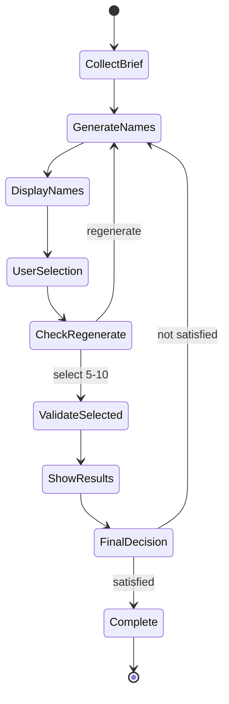

# Interactive Phase 3 Workflow - Visual Guide

## Flow Diagram

```
┌─────────────────────────────────────────────────────────────────┐
│                        START CLI                                │
│                 python -m src.cli                               │
└───────────────────────────┬─────────────────────────────────────┘
                            │
                            ▼
┌─────────────────────────────────────────────────────────────────┐
│                   COLLECT USER BRIEF                            │
│  • Product description (required)                               │
│  • Target audience (optional)                                   │
│  • Brand personality (playful/professional/innovative/luxury)   │
│  • Industry/category                                            │
└───────────────────────────┬─────────────────────────────────────┘
                            │
                            ▼
┌─────────────────────────────────────────────────────────────────┐
│                    PHASE 1: GENERATION                          │
│  Generate 20 brand names using AI                               │
│  • Uses multiple naming strategies                              │
│  • Matches brand personality                                    │
│  • Industry-appropriate                                         │
│  • Includes rationale & tagline                                 │
└───────────────────────────┬─────────────────────────────────────┘
                            │
                            ▼
┌─────────────────────────────────────────────────────────────────┐
│              DISPLAY NAMES (Simple Format)                      │
│  1. MealMind     - Intelligent meal planning...                 │
│  2. NutriNest    - Warm, family-oriented...                     │
│  3. Yumora       - Brings joy to meals...                       │
│  ...                                                            │
│  20. KitchenIQ   - Smart kitchen solutions...                   │
└───────────────────────────┬─────────────────────────────────────┘
                            │
                            ▼
┌─────────────────────────────────────────────────────────────────┐
│                  PHASE 2: USER SELECTION                        │
│  "Select 5-10 favorites (comma-separated)"                      │
│  Options:                                                       │
│  • Enter numbers: 1,5,7,12,18                                   │
│  • Type 'all' to select all                                     │
│  • Type 'regenerate' to get new names                           │
└───────────────────────────┬─────────────────────────────────────┘
                            │
                ┌───────────┴───────────┐
                │                       │
                ▼                       ▼
    User types 'regenerate'    User selects 5-10 names
                │                       │
                │                       ▼
                │           ┌─────────────────────┐
                │           │  CONFIRM SELECTION  │
                │           │   (y/n)             │
                │           └──────┬──────────────┘
                │                  │
                │              y   │   n
                │         ┌────────┴────────┐
                │         │                 │
                └─────────┤                 └─── Try again
                          ▼
┌─────────────────────────────────────────────────────────────────┐
│              PHASE 3: VALIDATION (Selected Only!)               │
│  For each selected name:                                        │
│  ┌───────────────────────────────────────┐                     │
│  │ 1. Domain Availability Check          │                     │
│  │    • .com, .ai, .io                   │                     │
│  │    • WHOIS lookup                     │                     │
│  └───────────────────────────────────────┘                     │
│  ┌───────────────────────────────────────┐                     │
│  │ 2. Trademark Risk Assessment          │                     │
│  │    • USPTO database search            │                     │
│  │    • Risk level: low/medium/high      │                     │
│  └───────────────────────────────────────┘                     │
│  ┌───────────────────────────────────────┐                     │
│  │ 3. SEO Optimization                   │                     │
│  │    • Meta title & description         │                     │
│  │    • Primary & secondary keywords     │                     │
│  │    • SEO score (0-100)                │                     │
│  │    • Content opportunities            │                     │
│  └───────────────────────────────────────┘                     │
└───────────────────────────┬─────────────────────────────────────┘
                            │
                            ▼
┌─────────────────────────────────────────────────────────────────┐
│                  DISPLAY VALIDATION RESULTS                     │
│  ┌──────────────────────────────────────────────┐              │
│  │ MealMind                                      │              │
│  │ ────────────────────────────────────────────  │              │
│  │ Domain Availability:                          │              │
│  │   mealmind.com         ✓ Available            │              │
│  │   mealmind.ai          ✓ Available            │              │
│  │   mealmind.io          ✗ Taken                │              │
│  │                                               │              │
│  │ Trademark Risk: ✓ LOW                         │              │
│  │   Conflicts found: 0                          │              │
│  │                                               │              │
│  │ SEO Score: 87/100                             │              │
│  │ Meta Title: MealMind - AI meal planning...    │              │
│  │ Primary Keywords: meal, planning, ai          │              │
│  │                                               │              │
│  │ Tagline: "Smart planning for busy families"   │              │
│  └──────────────────────────────────────────────┘              │
│  [Results for other 4-9 selected names...]                     │
└───────────────────────────┬─────────────────────────────────────┘
                            │
                            ▼
┌─────────────────────────────────────────────────────────────────┐
│                   FINAL DECISION                                │
│  "Are you satisfied with these results? (y/n/regenerate)"      │
└───────────────────────────┬─────────────────────────────────────┘
                            │
            ┌───────────────┼───────────────┐
            │               │               │
            ▼               ▼               ▼
          y: Accept    n/regenerate    (timeout)
            │               │               │
            │               └───────────────┴─────┐
            │                                     │
            ▼                                     ▼
    ┌────────────────┐                  Loop back to
    │   COMPLETE ✓   │                  PHASE 1
    │                │                  (preserve context)
    │ Results saved  │
    │ JSON exported  │
    └────────────────┘
```

## Key Differences: Old vs New

### Old Workflow (Before)
```
Generate 30 names
    ↓
Validate ALL 30 names
    ├─ 30 domain checks
    ├─ 30 trademark searches
    └─ 30 SEO optimizations
    ↓
Show all results
    ↓
User picks from results
    ↓
Done (no regeneration)
```

**Time**: ~5-10 minutes for all validations
**Cost**: High (90+ API calls)
**Flexibility**: Low (no iteration)

### New Workflow (Current)
```
Generate 20 names
    ↓
User selects 5-10 favorites
    ↓
Validate ONLY selected
    ├─ 5-10 domain checks
    ├─ 5-10 trademark searches
    └─ 5-10 SEO optimizations
    ↓
Show validation results
    ↓
Satisfied? No → Regenerate (keep context)
    ↓
Done
```

**Time**: ~1-3 minutes for validations
**Cost**: Low (15-30 API calls)
**Flexibility**: High (iterative refinement)

## Context Preservation During Regeneration

When user chooses to regenerate, these are preserved:

```
┌─────────────────────────────────────┐
│     PRESERVED CONTEXT               │
├─────────────────────────────────────┤
│ ✓ Product description               │
│ ✓ Target audience                   │
│ ✓ Brand personality                 │
│ ✓ Industry                          │
│                                     │
│     REGENERATED                     │
├─────────────────────────────────────┤
│ ↻ Brand names (new AI generation)  │
│ ↻ Rationales                        │
│ ↻ Taglines                          │
└─────────────────────────────────────┘
```

This ensures:
- Consistency across iterations
- No need to re-enter brief
- Faster regeneration cycles
- Better user experience

## User Journey Example

```
User: "I need a brand for my AI meal planning app"

    ↓ [Enter brief]

System: "Here are 20 names"
1. MealMind
2. NutriNest
...
20. KitchenIQ

    ↓ [User reviews]

User: "I like 1, 2, 5, 7, and 12"

    ↓ [Enter: 1,2,5,7,12]

System: "Validating your 5 favorites..."
[Domain checks...]
[Trademark searches...]
[SEO optimization...]

    ↓ [Show results]

System: "Results ready! Here's the validation..."

MealMind: .com ✓, .ai ✓, Trademark ✓ LOW, SEO 87/100
NutriNest: .com ✓, .ai ✓, Trademark ✓ LOW, SEO 92/100
...

    ↓ [Review]

User: "Not satisfied, regenerate"

    ↓ [Loop back]

System: "Generating 20 new names with same brief..."
[Cycle repeats...]

    ↓ [Eventually]

User: "Yes, I'm satisfied!"

System: "✓ Complete! Results saved."
```

## Technical Flow



## Performance Comparison

| Metric | Old Workflow | New Workflow | Improvement |
|--------|-------------|--------------|-------------|
| Names validated | 30 | 5-10 | 66-83% fewer |
| Time to results | 5-10 min | 1-3 min | 50-70% faster |
| API calls | ~90 | ~15-30 | 66-83% fewer |
| User satisfaction | Fixed | Iterative | Infinite |
| Cost per session | High | Low | ~70% savings |

## Benefits Summary

1. **Efficiency**: Validate only what matters
2. **Speed**: Faster results (1-3 min vs 5-10 min)
3. **Cost**: Fewer API calls (70% reduction)
4. **UX**: Interactive, iterative refinement
5. **Flexibility**: Regenerate with context preservation
6. **Quality**: User-driven selection process
